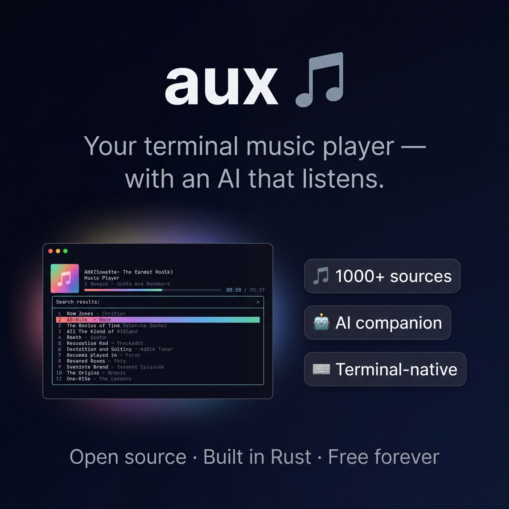

<p align="center">
  
</p>

<h1 align="center">aux 🎵</h1>
<p align="center"><b>Tell your AI agent what to play. It searches, picks, and plays — automatically.</b></p>

<p align="center">
  <a href="https://github.com/bonnguyenitc/aux/stargazers"></a>
  <a href="https://github.com/bonnguyenitc/aux/releases"></a>
  <a href="LICENSE"></a>
  <a href="https://www.rust-lang.org/"></a>
</p>

<p align="center">
  <a href="#-install">Install</a> · <a href="#-ai-agent-control-everything-by-chatting">AI Agent</a> · <a href="#-1000-music-sources-zero-ads">Sources</a> · <a href="#-aux-vs-the-rest">Compare</a> · <a href="CONTRIBUTING.md">Contribute</a>
</p>

---

<p align="center">
  
</p>

aux is an **open-source terminal music player** with a built-in **AI agent**. Instead of clicking through menus, just tell it what you want in natural language. The AI agent searches **1000+ sources**, controls playback, manages your library, and chains multi-step actions — all from a single chat message.

**No browser. No ads. No subscriptions. Built in Rust.**

## ⚡ Install

**One command:**

```bash
curl -sSL https://raw.githubusercontent.com/bonnguyenitc/aux/main/install.sh | sh
```

<details>
<summary><b>Manual install</b></summary>

```bash
# Install dependencies
brew install yt-dlp mpv           # macOS
# sudo apt install yt-dlp mpv     # Ubuntu/Debian
# sudo pacman -S yt-dlp mpv       # Arch

# Install aux
cargo install --path .
```

</details>

## 🎬 30-Second Quickstart

```bash
aux                                  # launch the TUI player
aux chat "play lofi coding music"    # AI finds & plays music for you
aux search "Adele"                   # manual search
aux play <url>                       # play any URL directly
```

Press `c` to open AI chat inside the TUI. Press `?` for help. That's it.

## 🤖 AI Agent: Control Everything by Chatting

The AI agent is **not a chatbot** — it's a **player controller**. Every message you send is parsed into executable actions. The agent can compose multi-step pipelines from a single sentence.

### Just say what you want

```
You: "play a random song by Ed Sheeran"
→ AI searches "Ed Sheeran" → picks random result → starts playing

You: "search lofi beats and play the 3rd one"
→ AI searches "lofi beats" → plays result #3

You: "add this to my Chill playlist, then play something by Adele"
→ AI adds to playlist → searches "Adele" → plays result
```

### Full action list

| Category          | What the AI agent can do                                         |
| ----------------- | ---------------------------------------------------------------- |
| **Search & Play** | Search any query, play by name, pick from results, play random   |
| **Playback**      | Pause, resume, seek, volume, speed, repeat, shuffle, sleep timer |
| **Library**       | Add/remove favorites, add to queue, clear queue                  |
| **Playlists**     | Create, delete, add tracks, play entire playlist                 |
| **Navigation**    | Switch panels (queue, favorites, history, lyrics)                |
| **Compose**       | Chain multiple actions in one message                            |

### How it works

```
┌─────────────┐     ┌──────────┐     ┌──────────────┐     ┌────────┐
│ Your message │ ──→ │ AI Agent │ ──→ │ Action Queue │ ──→ │ Player │
│ (any language)│     │ (LLM)    │     │ [search,play]│     │ (mpv)  │
└─────────────┘     └──────────┘     └──────────────┘     └────────┘
```

The AI agent returns structured JSON actions. aux executes them sequentially — search acts as a barrier, and downstream actions (play, random pick) fire automatically when results arrive.

### Supported AI providers

Works with **OpenAI**, **Anthropic**, **Google Gemini**, or **local Ollama**:

```bash
aux config ai --setup                 # 30-second guided wizard
```

## 🎧 1000+ Music Sources, Zero Ads

Powered by [yt-dlp](https://github.com/yt-dlp/yt-dlp), aux plays audio from YouTube, SoundCloud, YT Music, Bandcamp, and [1000+ sites](https://github.com/yt-dlp/yt-dlp/blob/master/supportedsites.md) — no browser, no account, no ads.

## 🔥 Why developers choose aux

- 🤖 **AI agent controls everything** — search, play, queue, favorites, playlists — all through chat
- 🎧 **1000+ sources, zero ads** — YouTube, SoundCloud, Bandcamp — no account needed
- 📝 **Auto-synced lyrics** — karaoke mode, right in the terminal
- 🎛️ **Full player** — queue, playlists, favorites, EQ, shuffle, repeat, sleep timer
- ⌨️ **Keyboard-only** — never leave your workflow
- 🔗 **Composable actions** — chain search + play + add-to-playlist in one sentence

## ⌨️ Keybindings

| Key     | Action             |     | Key       | Action             |
| ------- | ------------------ | --- | --------- | ------------------ |
| `Space` | Pause / Resume     |     | `f`       | Toggle favorite ❤️ |
| `←` `→` | Seek ±10s          |     | `a`       | Add to queue 📋    |
| `+` `-` | Volume ±5%         |     | `n` / `p` | Next / Previous    |
| `]` `[` | Speed up / down    |     | `r`       | Cycle repeat       |
| `/`     | New search         |     | `z`       | Toggle shuffle 🔀  |
| `e`     | Cycle EQ preset 🎛️ |     | `t`       | Sleep timer 😴     |
| `c`     | Open AI chat 💬    |     | `?`       | Help               |

### Results panel

| Key       | Action                                       |
| --------- | -------------------------------------------- |
| `Enter`   | Play selected result                         |
| `Shift+P` | **Queue ALL results and play from first** 🎵 |
| `a`       | Add selected result to queue                 |
| `f`       | Toggle favorite                              |
| `l`       | Add to playlist                              |
| `←` `→`   | Page prev / next                             |
| `/`       | New search                                   |

## 🎵 CLI reference

<details>
<summary><b>Playback</b></summary>

```bash
aux pause / resume / stop
aux now                              # what's playing
aux volume 80                        # set volume
aux seek +30 / -10 / 2:30            # seek
aux speed 1.5 / up / down            # playback speed
aux repeat off / one / all
aux shuffle
aux sleep 30m / 1h / off
```

</details>

<details>
<summary><b>AI Agent (Chat)</b></summary>

```bash
aux chat "play a random song by Adele"     # AI agent searches + plays
aux chat "add to favorites"                 # AI manages your library
aux chat "create playlist Workout"          # AI creates playlist
aux chat "what is this song about?"         # AI explains the song
aux chat                                    # open interactive chat
aux suggest                                 # AI suggests related tracks
```

</details>

<details>
<summary><b>Library</b></summary>

```bash
aux history                          # play history
aux favorites                        # list favorites (alias: aux fav)
aux fav add <url>                    # add to favorites
```

</details>

<details>
<summary><b>Queue & Playlists</b></summary>

```bash
aux queue                            # show queue (alias: aux q)
aux q add <url>                      # add to queue

aux playlist list                    # list playlists (alias: aux pl)
aux pl create "Chill Vibes"          # create playlist
aux pl play "Chill Vibes"            # play all
aux pl add "Chill Vibes" <url>       # add track
```

</details>

<details>
<summary><b>Equalizer</b></summary>

Five presets: `flat` · `bass-boost` · `vocal` · `treble` · `loudness`

```bash
aux eq                               # show current
aux eq bass-boost                    # set preset
```

</details>

<details>
<summary><b>Configuration</b></summary>

```bash
aux config player                    # show player settings
aux config player set --volume 80    # default volume
aux config ai --setup                # AI setup wizard

# Multiple AI profiles
aux config ai add-profile deep \
  --provider anthropic \
  --model claude-sonnet-4-6 \
  --api-key-env ANTHROPIC_API_KEY

aux config ai add-profile local \
  --provider ollama \
  --model llama4 \
  --base-url http://localhost:11434
```

Config file: `~/.config/aux/config.toml`

</details>

## 🏆 aux vs the rest

|                                  | Spotify | YouTube | cmus | aux |
| -------------------------------- | ------- | ------- | ---- | --- |
| Search & play                    | ✅      | ✅      | ❌   | ✅  |
| Queue, playlists, favorites      | ✅      | ✅      | ✅   | ✅  |
| Shuffle, repeat, EQ, sleep timer | ✅      | ✅      | ✅   | ✅  |
| Synced lyrics                    | ✅      | ❌      | ❌   | ✅  |
| **AI agent control**             | ❌      | ❌      | ❌   | ✅  |
| **Natural language playback**    | ❌      | ❌      | ❌   | ✅  |
| **Composable action chains**     | ❌      | ❌      | ❌   | ✅  |
| **Terminal-native**              | ❌      | ❌      | ✅   | ✅  |
| **1000+ audio sources**          | ❌      | ❌      | ❌   | ✅  |
| **Open source**                  | ❌      | ❌      | ✅   | ✅  |
| **Free forever**                 | ❌      | ❌      | ✅   | ✅  |
| Multi-device sync                | ✅      | ✅      | ❌   | ❌  |
| Offline downloads                | ✅      | ✅      | ✅   | ❌  |

## 🛠️ Built with

[Rust](https://www.rust-lang.org/) · [ratatui](https://github.com/ratatui/ratatui) · [mpv](https://mpv.io/) · [yt-dlp](https://github.com/yt-dlp/yt-dlp) · [SQLite](https://www.sqlite.org/)

## 📄 License

MIT — see [LICENSE](LICENSE) for details.

---

<p align="center">
  <b>If you find aux useful, please consider giving it a ⭐</b><br/>
  It helps others discover the project and motivates continued development.
</p>

<p align="center">
  <a href="https://github.com/bonnguyenitc/aux/issues">Report Bug</a> · <a href="https://github.com/bonnguyenitc/aux/discussions">Request Feature</a> · <a href="CONTRIBUTING.md">Contribute</a>
</p>
